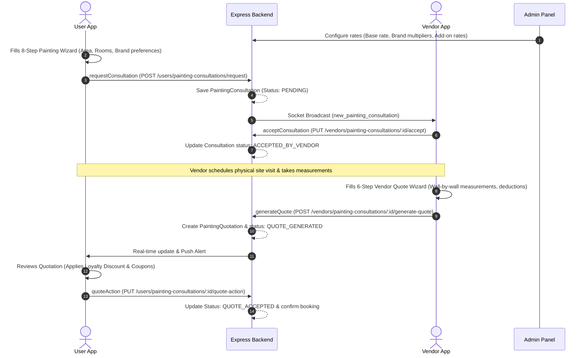

# UrbanPaint / Painting Consultation Module Workflow

This document outlines the detailed end-to-end workflow of the **Painting Consultation Module (UrbanPaint)** in Doormeets. It covers the database design, real-time socket events, step-by-step user and vendor wizards, calculation formulas, and admin configurations.

---

## 1. Database Schema Architecture

The module is powered by three main Mongoose schemas: `PaintingConsultation`, `PaintingQuotation`, and the global `Settings` document.

### A. PaintingConsultation Schema (`models/PaintingConsultation.js`)
Stores the initial project layout, customer inputs collected during the user wizard, assignees, and progress status.
- **userId**: Reference to the customer (`User` model).
- **propertyType**: BHK configurations (`1BHK`, `2BHK`, `3BHK`, `Villa`, `Commercial`).
- **address**: Street, city, state, pincode, fullAddress.
- **wizardData**:
  - **projectType**: `INTERIOR` or `EXTERIOR`.
  - **rooms**: Array of rooms detailing name, dimensions, subtractions, paint selection, repairs, estimated cost.
  - **utilities**: Toggles and enamel/additional options for doors, grills, windows, panels.
  - **additionalServices**: Waterproofing, POP repair, wallpaper removal status.
  - **paintBrand**: Asian Paints, Dulux, Berger.
  - **upgradeOption**: `NONE`, `PREMIUM`, `LUXURY`.
  - **grandTotal** / **estimatedTotal**: Computed price estimates.
  - **scheduling**: Preferred start date, estimated work days, number of painters, P-Mode style.
- **status**: Status machine tracking states:
  - `PENDING` (Initial request broadcasted to all vendors).
  - `ACCEPTED_BY_VENDOR` (A vendor has claimed the request).
  - `QUOTE_GENERATED` (Vendor visited, completed onsite survey, and submitted quotation).
  - `QUOTE_ACCEPTED` / `QUOTE_DECLINED` (User finalized booking or rejected the quotation).
  - `DECLINED_BY_VENDOR` (Vendor dropped the request).
  - `COMPLETED` (Project finished).
- **vendorId**: Assigned `Vendor` model reference.
- **quotationId**: Associated `PaintingQuotation` document reference.

### B. PaintingQuotation Schema (`models/PaintingQuotation.js`)
Saves the official detailed quotation generated by the vendor during/after the physical site visit.
- **customerId**: Reference to the customer (`User`).
- **vendorId**: Reference to the estimating vendor (`Vendor`).
- **consultationId**: Reference to the original consultation request.
- **rooms**: Array of room quote items, containing:
  - Room dimensions (sqft).
  - Sub-toggles for ceiling inclusion.
  - Array of specific wall measurements + wardrobes/doors/windows size deductions.
  - Breakdown: paint cost, labor cost, subtotal.
- **additionalServices**: Array of global service items.
- **woodEnamel**: Specific items for wood polish (glossy/matte) and enamel items.
- **materials**: Computed material logistics (Wall Paint Liters, Primer Liters).
- **calculation**: Object storing paint cost, putty cost, primer cost, labour cost, services cost, wood/enamel cost, discount amounts, GST, and final grandTotal.

---

## 2. Core Workflow Sequence

---

## 3. User-Side Consultation Request (Vite Client Wizard)

When a user opens the **UrbanPaint** category in the app:
1. **Property Layout Presets**: User chooses a layout (1BHK, 2BHK, 3BHK, etc.). This loads dynamic presets configured in Admin settings.
2. **Step 1: Room Details**: User lists and names rooms needing paint (e.g. Master Bedroom, Living Room).
3. **Step 2: Room Configuration & Estimation**: User enters general length & width for rough area estimates.
4. **Step 3: Select Paint Finish**: Selects paint qualities (Economy, Premium, Luxury) and finishes (Matte, Satin, Gloss).
5. **Step 4: Utilities selection**: Toggles utility items (Doors, Grills, Windows, Panels) and configures whether they need enamel painting.
6. **Step 5: Add-ons**: Selects global services like waterproofing, POP repair, or deep cleaning.
7. **Step 6: Brand selection**: User sets brand preference (Asian Paints, Dulux, Berger) which applies rate adjustments.
8. **Step 7: Estimate Summary**: Displays a rough estimation calculated in frontend.
9. **Step 8: Scheduling**: Selects preferred start date, number of painters, and P-Mode style (Assembly vs Basic).
10. **Submission**: Calls `/api/users/painting-consultations/request`.
    - Backend generates a `PaintingConsultation` document.
    - Emits a real-time WebSocket event `new_painting_consultation` via Socket.io to the `'all_vendors'` room.
    - Displays a toast alert to nearby vendors: *“New Painting Consultation Request in [City]”*.

---

## 4. Vendor Site-Visit & Quotation Generation

After a vendor accepts the consultation request (status updates to `ACCEPTED_BY_VENDOR`), the vendor schedules a physical site visit. During the visit, the vendor uses the **Vendor Quote Wizard** to generate a precise quotation.

### Wizard Step 1: Create Survey
- Vendor selects the project scope (Interior Only, Exterior Only, or Both).
- Selects the rooms to paint from the user's request, with the option to add custom rooms.

### Wizard Step 2: Room Details & Wall Specifications
For each selected room, the vendor inputs:
- **Repair Type**: Selects one of:
  - `Paint Only` (Direct application).
  - `Primer + Paint` (Primer coat first).
  - `Putty + Primer + Paint` (Full surface preparation).
- **Wall Specifications**: Add walls one-by-one:
  - Input Length (ft) and Height (ft) to calculate Gross Area.
  - **Deductions**: Sub-input arrays for Windows, Doors, and Wardrobes. The vendor enters `Width x Height` for each deduction.
  - Net Area is calculated dynamically:
    $$\text{Net Area} = (\text{Length} \times \text{Height}) - \sum (\text{Width}_{\text{deduct}} \times \text{Height}_{\text{deduct}})$$
  - **Surface Conditions**: Toggles dampness treatment or crack filling per wall.
- **Ceiling**: Toggle to include ceiling. Enter Length & Width to calculate ceiling area.
- **Additional Services**: Toggle room-specific services (e.g. POP repair, texture painting, deep cleaning).

### Wizard Step 3: Utilities Selection
Select utility items (doors, windows, grills, panels) and toggle Enamel Painting or other custom services.

### Wizard Step 4: Measurements Calculation
The app calculates structural measurements and subtotals:
- **Base Rate & Multiplier**: Uses the admin base rate (e.g., ₹10/sqft). If the room's total sqft matches an admin-configured range, the `rateMultiplier` adjusts the cost.
- **Consumables Coverage**:
  - **Paint Liters**: $\text{Net Area} \div 12 \text{ sqft/liter}$
  - **Primer Liters**: $\text{Net Area} \div 14 \text{ sqft/liter}$ (if repair type includes primer)
  - **Putty Kg**: $\text{Net Area} \div 3 \text{ sqft/kg}$ (if repair type includes putty)
- **Room Costing**:
  - Paint cost: $\text{Net Area} \times \text{Base Rate} \times \text{Multiplier}$
  - Labor cost: $\text{Net Area} \times \text{Labor Rate} \times \text{Multiplier}$
  - Primer/Putty costs: calculated using admin-configured sqft rates if active.

### Wizard Step 5: Paint Package Selection
Vendor selects the paint brand (Asian Paints, Dulux, Berger) and quality package (Economy, Premium, Luxury) to apply brand multipliers.

### Wizard Step 6: Finalize Bill & Submit
- Selects number of painters, preferred start date, P-Mode style, and estimates total work days.
- Applies vendor-specific discount percentages.
- Calculates subtotal and grand total.
- Submits via `POST /api/vendors/painting-consultations/:id/generate-quote`.
  - Creates a `PaintingQuotation` document.
  - Links it to the consultation request and updates the status to `QUOTE_GENERATED`.
  - Notifies the customer.

---

## 5. User Quotation Approval Flow

The user views the generated quote in their app:
1. **Quotation Details View**: Shows painter details, notes, room-by-room breakdown, and calculated material requirements (Liters of paint/primer needed).
2. **Promotional Discounts**:
   - User can enter a promo coupon code.
   - **Loyalty Points Slider**: User can drag the slider (0% to 15%) to apply loyalty discounts.
3. **Action Toggles**:
   - **Confirm & Book**: Calls `PUT /api/users/painting-consultations/:id/quote-action` with body `{ action: 'ACCEPT', couponCode, loyaltyDiscount }`.
     - Updates consultation status to `QUOTE_ACCEPTED` and quotation status to `ACCEPTED`.
     - Confirms the project booking.
   - **Decline**: Calls `/api/users/painting-consultations/:id/quote-action` with body `{ action: 'DECLINE' }`.
     - Updates status to `QUOTE_DECLINED`.

---

## 6. Admin Panel Control Settings

The Admin Panel has full control over the parameters used by the calculations:
1. **Consultation Dashboard (`ConsultationDashboard.jsx`)**:
   - Monitorders metrics: Total requests, Pending, Claimed by vendor, Quote generated, and Quote accepted.
   - Displays conversion rates:
     $$\text{Conversion Rate} = \left( \frac{\text{Quote Accepted}}{\text{Total requests}} \right) \times 100$$
2. **Pricing Configuration Settings (`PaintingPricingConfig.jsx`)**:
   - **Wall Paint Base Rate**: Global base rate per sqft.
   - **Brand Packages**: Set standard, premium, and luxury sqft rates for brands (Asian Paints, Dulux, Berger, etc.).
   - **Utility Rates**: Custom enamel painting and additional service rates per sqft for Doors, Grills, Windows, and Panels.
   - **Additional Services**: Set flat or sqft rates for waterproofing, POP repair, wallpaper removal, texture painting, and deep cleaning.
   - **Sqft Price Multipliers**: Adjust base prices for overall project sizes (e.g., 0.9x multiplier for >2000 sqft).
   - **Window & Door Size Price Bands**: Price brackets based on deduction area dimensions.
   - **Dynamic BHK Layouts**: Edit properties, images, tag details, and room setups shown to users.
   - Saving settings calls `PUT /api/admin/settings` to update global parameters.
