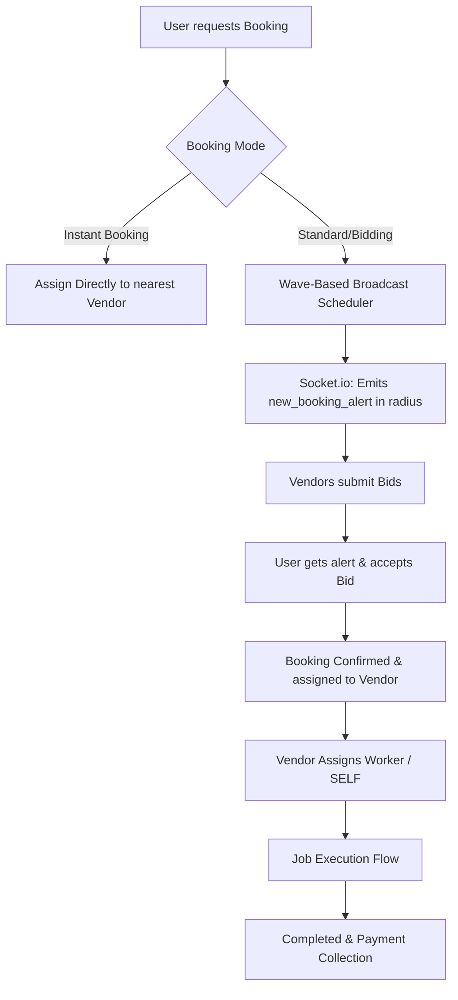

# Doormeets - Complete Project Workflow Architecture

This document provides a detailed end-to-end workflow of the **Doormeets** project. It details the technical stack, database models, API routes, controller actions, real-time events, and frontend-to-backend flows for each major module in the system.

---

## 1. Project Technology Stack

- **Frontend**:
  - **Framework**: React.js with Vite builder
  - **Styling**: Tailwind CSS & Vanilla CSS
  - **State / Context**: React Context (e.g., `SocketContext.jsx` for real-time integrations)
  - **Networking**: Axios (configured in `services/api.js` with credentials and base path mapping)
  - **Alerts**: React Hot Toast
  - **Real-Time WebSockets**: Socket.io Client

- **Backend**:
  - **Runtime**: Node.js with Express web framework
  - **Database**: MongoDB using Mongoose ORM
  - **Caching & Session State**: Redis (optional caching layers, configured in `services/redisService.js`)
  - **Real-Time Messaging**: Socket.io (server-side implementation in `sockets/index.js`)
  - **Push Notifications**: Firebase Cloud Messaging (FCM)
  - **Task Scheduling**: Node-cron/internal timers for wave-based booking notifications

---

## 2. Authentication & User Management Workflow

### User Authentication Flow
1. **Frontend Input**: User enters mobile phone number on the Sign In page.
2. **OTP Generation**:
   - Frontend calls `api.post('/users/auth/send-otp')`.
   - Backend controller generates a numeric OTP, stores it temporarily with an expiration timer, and invokes SMS service (or falls back to Firebase Auth OTP/Console logging).
3. **Verification & Token Issue**:
   - User inputs the received OTP.
   - Frontend calls `api.post('/users/auth/verify-otp')`.
   - Backend validates the OTP. If valid:
     - Creates/retrieves the `User` model document.
     - Generates a JSON Web Token (JWT) containing user ID and role (`user`).
     - Sends the JWT inside an HTTP-only secure cookie or Authorization Header.
4. **Session Establishment**: Subsequent user requests validate the JWT token via `middleware/authMiddleware.js`.

### Vendor Authentication & Onboarding Flow
1. **Registration**: Vendor signs up by submitting personal information, location coordinates, profile details, and category registrations.
   - Endpoint: `api.post('/vendors/auth/register')`.
2. **Verification Pipeline**:
   - **Police Verification**: Upload files to `api.post('/vendors/verification/police-verification')`.
   - **Training Module**: Vendor must watch training videos (`api.get('/vendors/training/videos')`) and complete a multiple-choice quiz (`api.post('/vendors/training/verify-quiz')`).
3. **Subscription Activation**:
   - Vendor must choose and subscribe to a subscription plan to receive booking alerts.
   - Endpoints: `/api/vendors/subscription` and `/api/vendors/subscription/purchase`.
   - If active, `middleware/roleMiddleware.js` (`checkSubscription` check) allows protected dashboard, booking, and catalog access.

---

## 3. General Booking Lifecycle & Bidding Workflow

### Step 1: User Initiates a Booking
1. **Frontend Form**: User selects a service (e.g., plumbing, electric), selects date, time-slot, address, and selects preferred layout/options.
2. **API Trigger**:
   - Frontend calls `api.post('/api/users/bookings/', payload)`.
   - Backend controller `userBookingController.createBooking` runs validations, checks availability, calculates base price, and saves a new `Booking` document with status `pending`.

### Step 2: Wave-Based Alerting & Broadcast Scheduler
1. **Scheduler Trigger**:
   - Once a booking is created, the backend `bookingScheduler` is notified.
   - It searches for online, subscribed vendors within a matching category inside a specific geofence radius (e.g., 5km).
2. **Broadcasting**:
   - Emits a real-time event `new_booking_alert` via Socket.io to matching vendors.
   - If no vendor accepts within a configured timeout window (e.g., 2 minutes), the scheduler expands the geofence radius (e.g., to 10km) and broadcasts to the next "wave" of vendors.
   - Subscribed vendors also receive Firebase Push notifications (FCM) on their mobile apps.

### Step 3: Bidding / Direct Accept
- **Direct Acceptance**: If the service has instant-booking enabled, the first vendor to call `/api/vendors/bookings/:id/accept` secures the booking.
- **Bidding Mode**:
  1. Vendor receives the details and proposes a bid price or accepts terms via `api.post('/api/bids/submit', { bookingId, bidAmount, notes })`.
  2. The bid is stored in `Bid` collection. User is notified via socket `new_bid_received`.
  3. User reviews bids by fetching `api.get('/api/bids/:bookingId')`.
  4. User accepts a specific bid via `api.post('/api/bids/accept/:bidId')`.
  5. System marks the chosen bid as accepted, rejects other bids, updates the booking status to `confirmed`, and assigns the vendor ID to the `Booking`.

### Step 4: Job Execution Flow (Self-Job & Worker Assignment)
1. **Worker Assignment**: Vendor assigns a worker or decides to complete it themselves (SELF).
   - Endpoint: `api.post('/api/vendors/bookings/:id/assign-worker', { workerId: 'SELF' | ObjectId })`.
2. **Start Job**:
   - Vendor clicks "Start Job" on the app.
   - Endpoint: `api.post('/api/vendors/bookings/:id/self/start')`. Status updates to `in_progress`.
3. **Reached Location**:
   - Vendor checks in once they reach the user's location coordinates.
   - Endpoint: `api.post('/api/vendors/bookings/:id/self/reached')`. Status updates to `visited`.
4. **Visit Verification**:
   - Vendor triggers a verification check (e.g., OTP sent to user, or user tap on screen).
   - Endpoint: `api.post('/api/vendors/bookings/:id/self/visit/verify')`.
5. **Complete Job**:
   - Vendor completes the physical task, updates details, and uploads completion photo.
   - Endpoint: `api.post('/api/vendors/bookings/:id/self/complete')`. Status updates to `work_done`.
6. **Payment & Settlement**:
   - Vendor requests payment. If Cash on Delivery, vendor collects physical money and logs it.
   - Endpoint: `api.post('/api/vendors/bookings/:id/self/payment/collect')`.
   - Booking status updates to `completed`.
   - Backend calculates platforms commission, credits the vendor wallet, and handles referral rewards.

---

## 4. Vendor Wallet & Payout System

1. **Transaction Entry**: On job completion, a `Transaction` entry records the earned amount minus platform commission.
2. **Wallet Ledger**: The `Vendor` model's wallet balance increases.
3. **Withdrawal Requests**:
   - Vendor requests a payout: `api.post('/api/vendors/withdrawal', { amount, bankDetails })`.
   - Saves a `Withdrawal` document with status `PENDING`.
4. **Admin Approval**:
   - Admin reviews withdrawal queue on the Admin Panel.
   - Invokes `api.put('/api/admin/settlements/:withdrawalId', { status: 'APPROVED' | 'REJECTED' })` which processes bank transfer/UPI payouts.

---

## 5. Stock Request & Shop Module

1. **Catalog Setup**: Shop Owners manage their parts catalogs.
2. **Vendor Purchase**:
   - Vendor places request for parts/consumables (e.g., paint, putty, pipe fittings): `api.post('/api/stock/request', { items, shopId })`.
   - Saves a `StockRequest` record.
3. **Delivery & Invoice**:
   - Shop owner accepts stock request, updates delivery status.
   - Generates an `Invoice` document upon delivery, deducting amount from Vendor's ledger or settling cash/credit terms.

---

## 6. Safety System (SOS Trigger)

- **Triggers**: If a User or Vendor feels unsafe during an active booking session, they press the **SOS** button on the UI.
- **Frontend Action**: Dispatches GPS coordinates to the server.
- **Backend Flow**:
  - Endpoint: `api.post('/api/users/sos')` or `api.post('/api/vendors/sos')`.
  - Instantly logs an `SOSAlert` record.
  - Broadcasts a real-time high-priority socket alert `admin_sos_alert` to all active Admin socket sessions.
  - Sends SMS alerts / triggers automated phone calls to emergency numbers and customer support.

---

## 7. Push Notifications & Sockets System

- **Sockets**: Core socket handlers in `sockets/index.js` define rooms based on role:
  - `join_room` for private notifications: `user_id` or `vendor_id`.
  - `all_vendors` room: for broadcasting consultation/booking alerts.
  - `admin_dashboard` room: for SOS alerts and conversion metrics.
- **FCM Tasks**: Background workers trigger standard push notifications for status updates (e.g., "Worker assigned", "Booking Completed", "New quote received").
